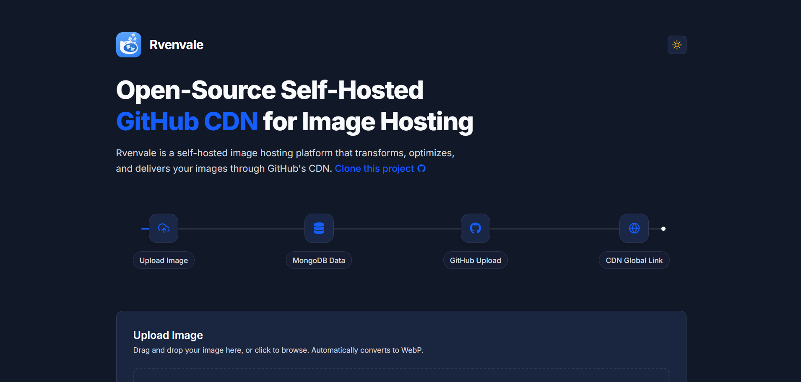

<p align="center">
  
</p>

<h1 align="center">Rvenvale</h1>

<p align="center">
  <strong>Open-Source Self-Hosted GitHub CDN for Image Hosting.</strong>
</p>

<p align="center">
  <a href="https://github.com/nekowawolf/rvenvale/blob/main/LICENSE"></a>
  
  
</p>

<p align="center">
  <a href="https://rvenvale.vercel.app">Website</a>
</p>

---

<br />

<div align="center">
  <picture>
    
  </picture>
</div>

<br />

Rvenvale is a self-hosted image hosting platform that transforms, optimizes, and delivers your images through GitHub's CDN. Stop relying on expensive cloud storage for simple image hosting.

## Features

- **GitHub CDN Integration**: Upload your images and serve them instantly via a global, high-availability CDN.
- **Automatic WebP Conversion**: Images are automatically converted to the WebP format upon upload to save bandwidth and improve load performance.
- **Image Analytics**: Track total uploaded images and calculate total storage size straight from your dashboard.
- **Self-Hosted First**: Run your own instance easily with complete control over your database and assets.
- **Copy & Share**: 1-click URL copying for immediate embedding.

## Tech Stack

- **Backend**: Golang, Fiber framework, MongoDB
- **Frontend**: Next.js, TailwindCSS, Framer Motion
- **Storage**: GitHub Pages API

## How to Use

### 1. Prepare your GitHub CDN Repository
Before starting, you need a public GitHub repository with **GitHub Pages** enabled to act as your CDN. 
*Example CDN repository:* [nekowawolf/rvenvale-cdn](https://github.com/nekowawolf/rvenvale-cdn)

### 2. Clone the repository
```bash
git clone https://github.com/nekowawolf/rvenvale.git
cd rvenvale
```

### 3. Configure Environment Variables

**Backend Configuration:**
Navigate to the `backend` folder and create a `.env` file. Replace the values with your actual credentials:
```env
MONGOSTRING=mongodb+srv://<user>:<password>@cluster.mongodb.net/
GITHUB_TOKEN=your_github_personal_access_token
GITHUB_USERNAME=your_github_username
GITHUB_REPO=your_github_repo_name
GITHUB_UPLOAD_DIR=images
ALLOWED_ORIGIN=http://localhost:3001
PORT=3000
```
*Note: Make sure your GitHub token has repository write permissions to successfully upload images.*

**Frontend Configuration:**
Navigate to the `frontend` folder and create a `.env` file:
```env
NEXT_PUBLIC_API_BASE_URL=http://localhost:3000/rvenvale
```

### 4. Run the Backend
```bash
cd backend
go mod tidy
go run main.go
```

### 5. Run the Frontend
```bash
cd frontend
npm install
npm run dev
```

Your frontend will be available at `http://localhost:3001`.

## Contributing

Bug reports, feature requests, and PRs welcome. Read the [contributing guide](https://github.com/nekowawolf/rvenvale/blob/main/CONTRIBUTING.md).

## Contributors

All thanks to our contributors:

<a href="https://github.com/nekowawolf/rvenvale/graphs/contributors">
  
</a>

## License

MIT